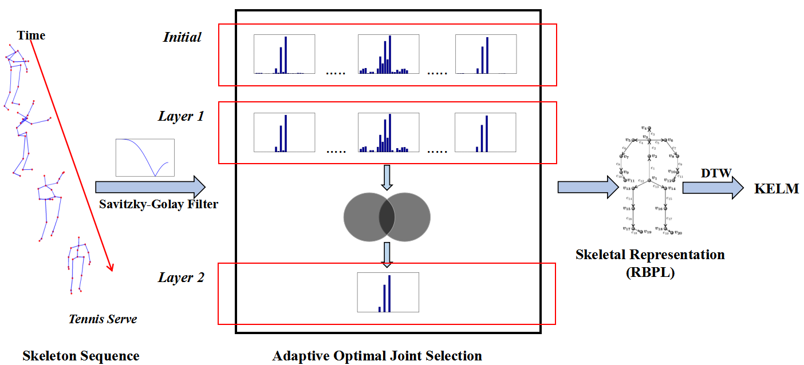

DFMSDV
====

Matlab Implementation of our ACCV16 paper 
[Action Recognition Based on Optimal Joint Selection and Discriminative Depth Descriptor](https://link.springer.com/chapter/10.1007/978-3-319-54184-6_17).

<div align=center></div>

Platform Description
----
Matlab R2012b, Windows 8.1 (64 bits).

Data Preparation
----
We think that we have no rights to redistribute data. So please prepare data as follows:
1. We use MSR Action3D dataset as our benchmark dataset. Please download it from this [link](https://www.uow.edu.au/~jz960/datasets/MSRAction3D.html). 
And then run **DMM-disLBP/DepthPreProcessing.m** to change all the files in *MSRAction3D/Depth* from '.bin' to '.mat'. 
Please put these '.mat' files to the directory *DMM-disLBP/data/Action3D*.
2. Our skeleton descriptor OJSDTJ-RBPL leverages [an existing approach](http://ravitejav.weebly.com/uploads/2/4/7/2/24725306/human_action_recognition_by_representing_3d_skeleton_as_point_in_lie_group.pdf). 
Our codes directly utilizes its processed data. Please download it from this [link](http://ravitejav.weebly.com/contact-form-for-action-recognition-code.html)
 (The access to data requires you to enter some information). 
 And then enter the directory *skeletal_action_recognition_code/data/MSRAction3D/* and put "body_model.mat" and "skeletal_data.mat" to the 
 directory *OJSDTJ-RBPL/data*.
3. Our depth descriptor DMM-disLBP also leverages [an existing approach](https://docs.google.com/viewer?a=v&pid=sites&srcid=ZGVmYXVsdGRvbWFpbnxjaGVucmVzZWFyY2hzaXRlfGd4OjMzMzcwNzY5YWViZDQ1MmY).
Our codes also utilizes its processed data. Please download it from this [link](https://sites.google.com/site/chenresearchsite/DMM-LBP.zip?attredirects=0&d=1).
And then enter the directory *DMM-LBP/* and put "Action3D_sample_list.mat" to the directory *DMM-disLBP/data*.

Quick Start
----
1. For skeleton-based action recognition, please first filter the skeletal data using **OJSDTJ-RBPL/filtering_raw_skeletal.m** 
and then directly run **OJSDTJ-RBPL/skeleton_recognition_pipeline.m**.
2. For depth maps-based action recognition, please directly run **DMM-disLBP/depth_recognition_pipeline.m**.
3. After obtaining the results of OJSDTJ-RBPL and DMM-disLBP, run **DFMSDV.m** to fuse these two methods. 

Citing DFMSDV
----
If you find our approaches useful in your research, please consider citing:
```
@inproceedings{ni2016action,
  title={Action Recognition Based on Optimal Joint Selection and Discriminative Depth Descriptor},
  author={Ni, Haomiao and Liu, Hong and Wang, Xiangdong and Qian, Yueliang},
  booktitle={Asian Conference on Computer Vision},
  pages={273--287},
  year={2016},
  organization={Springer}
}
```
For any problems with the code, please feel free to contact me: homerhm.ni@gmail.com

Acknowledgement
----
Our OJSDTJ-RBPL borrowed some functions from Raviteja Vemulapalli's work ([paper](http://ravitejav.weebly.com/uploads/2/4/7/2/24725306/human_action_recognition_by_representing_3d_skeleton_as_point_in_lie_group.pdf)
,[code](http://ravitejav.weebly.com/contact-form-for-action-recognition-code.html)) 
and Our DMM-disLBP borrowed some functions from Chen Chen's work ([paper](https://docs.google.com/viewer?a=v&pid=sites&srcid=ZGVmYXVsdGRvbWFpbnxjaGVucmVzZWFyY2hzaXRlfGd4OjMzMzcwNzY5YWViZDQ1MmY), 
[code](https://sites.google.com/site/chenresearchsite/DMM-LBP.zip?attredirects=0&d=1)) 
and Guoying Zhao's work ([paper](https://www.sciencedirect.com/science/article/pii/S0031320312001604), [code](http://www.cse.oulu.fi/CMV/Downloads/LBPMatlab?action=AttachFile&do=view&target=disCLBP.zip)).


